This repository is part of 
- The project "CiberIA: Investigación e Innovación para la Integración de Ciberseguridad e Inteligencia Artificial" (Proyecto C079/23), financed by "European Union NextGeneration-EU, the Recovery Plan, Transformation and Resilience", through INCIBE.
- The Programa Global de Innovación en Seguridad for the promotion of Cátedras de Ciberseguridad en España, funded by the European Union NextGeneration-EU Funds, through the Instituto Nacional de Ciberseguridad (INCIBE).

---

# NICS CyberLab

NICS CyberLab is a reproducible cybersecurity experimentation and training platform for **IT and hybrid IT/OT environments**. It combines automated infrastructure deployment, visual scenario construction, node-level tool installation, role-oriented operational access, attack-and-detection exercises, and forensic acquisition, preservation, analysis, and reporting inside a single workflow.

The platform is designed to support both **educational use** and **professional experimentation**. A user can deploy the environment, build a scenario, prepare the required tools, execute attacks and monitoring actions, preserve evidence when incident severity justifies forensic escalation, and review the resulting case through a dedicated forensic reporting surface.

---

## 1. Infrastructure deployment

This is the first step and the most important requirement before using the rest of the platform.

### Baseline host requirements

Use the following baseline for a stable deployment:

- **Ubuntu 24.04 LTS**
- **8 CPU cores**
- **48 GB RAM**
- **500 GB of free disk space**
- **Hardware virtualization enabled**

If the platform is executed inside **VirtualBox** or **VMware**, virtualization must be enabled in the BIOS or UEFI and exposed to the guest. In practice, this means enabling **nested virtualization**. Without it, the OpenStack environment may fail to deploy correctly or may behave unreliably.

A full OpenStack deployment typically takes **around 30 minutes** under these baseline conditions.

### Deploy the OpenStack environment

Run the installer from the project root:

```bash
bash openstack-installer/openstack-installer.sh
```

After the deployment completes:

- the OpenStack virtual environment is created automatically at:

```bash
openstack-installer/openstack_venv
```

- the OpenStack credentials file is generated automatically at:

```bash
admin-openrc.sh
```

### Start the platform UI

To launch the platform dashboards, run:

```bash
bash start_dashboard.sh
```

This script is located in the project root.

On the **first launch**, startup may take longer because dependencies need to be installed.

### Recover OpenStack services after disk-related failures

If OpenStack services stop because the host ran out of disk space, first recover free space and then restart the services with:

```bash
bash restart_openstack.sh
```

This script is also located in the project root.

---

## 2. Platform workflow

NICS CyberLab follows a progressive workflow:

1. **Deploy the OpenStack infrastructure**
2. **Start the platform dashboards**
3. **Create the base IT scenario**
4. **Extend the scenario with industrial components when needed**
5. **Install the required tools on the deployed nodes**
6. **Access the installed tools through the operational portal**
7. **Execute attack-and-detection exercises**
8. **Preserve and analyze evidence when incidents require forensic escalation**
9. **Review the preserved case, artifact inventory, manifest, chain of custody, and pipeline events**

This design allows the user to move from infrastructure provisioning to full cybersecurity experimentation and case-centered forensic review without leaving the platform.

---

## 3. Main platform services

## IT Scenario Editor

The **IT Scenario Editor** is the service used to create and deploy the base IT scenario on the virtualized infrastructure.

It allows the user to:

- create nodes with roles such as **monitor**, **attack**, and **victim**
- connect nodes visually through an editable topology
- configure deployment parameters per node
- load, deploy, and destroy scenarios from the same interface

Each node can be configured with deployment-related fields such as:

- primary network
- primary subnetwork
- image
- flavor
- security group
- SSH key

For a basic three-node IT scenario, deployment typically takes **around eight minutes**, depending on infrastructure load and resource availability.

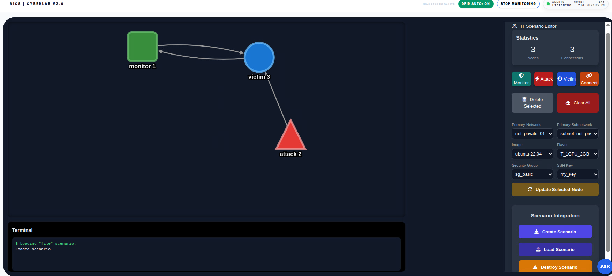

### Why it matters

This service reduces the gap between conceptual topology design and real OpenStack deployment. Instead of manually preparing instances, networks, and deployment parameters, the user can model the scenario visually and launch it directly.

---

## Industrial Scenario Editor

The **Industrial Scenario Editor** extends the base IT scenario with OT-oriented components and makes it possible to build hybrid **IT/OT** environments.

It allows the user to:

- load the base scenario
- add industrial components such as **PLC** and **SCADA**
- connect industrial nodes to the existing topology
- save or remove the industrial extension
- open the industrial application after deployment

Once an industrial component is available, the user can continue practical configuration tasks. For example, a deployed PLC can be opened in **OpenPLC** for control logic setup.

The project also includes prepared industrial examples, including:

```bash
PLC/plc_programs/TankControl.st
```

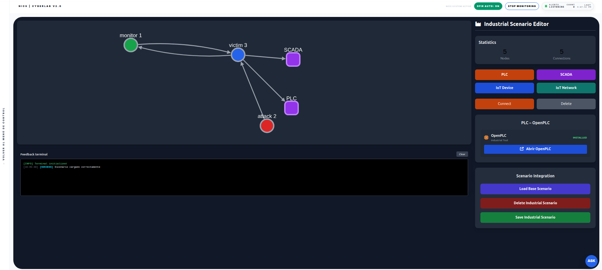

### Why it matters

This service transforms a conventional IT scenario into a hybrid IT/OT environment without forcing the user into a separate workflow. The industrial stack becomes part of the same scenario model, which improves continuity, usability, and reuse.

---

## Instance Tools Manager

The **Instance Tools Manager** prepares the deployed scenario for practical use by installing the required tools on each node.

It allows the user to:

- inspect the currently deployed instances
- select a target node
- view the node in the current topology
- choose tools from a predefined catalog
- launch automated installation workflows
- observe live terminal feedback
- inspect host-side tools on the control node

Example tools available through this service include:

- Wazuh
- Wazuh Agent
- Suricata
- Snort
- Nmap
- MITRE Caldera
- MITRE Caldera Agent
- TCPDump
- Zeek
- Caldera OT Plugins

Installation output is shown in the interface and preserved in backend logs for troubleshooting and later review.

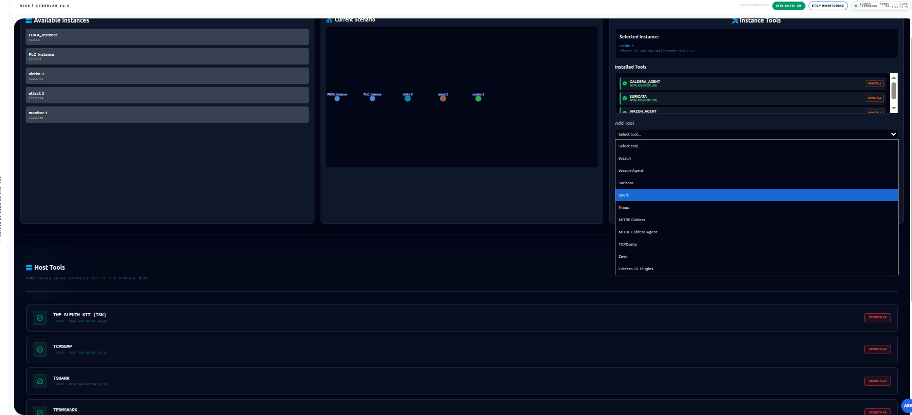

### Why it matters

This service turns a deployed scenario into an experiment-ready environment. Instead of manually connecting to each instance and installing tools one by one, the user can prepare the nodes centrally and consistently.

---

## Security Training and Tools Portal

The **Security Training and Tools Portal** is the service that gives the user direct access to the tools already installed on the scenario nodes.

It organizes the environment into role-based panels such as:

- **Attacker Node**
- **Central Monitor**
- **Victim Node**

From these panels, the user can:

- open the real dashboard or access point of the installed tool
- check whether a node is active
- open the remote instance console
- perform auxiliary management actions
- observe operational feedback in the activity area

This service is designed for both **training** and **professional practice**. The user works with real tools inside the deployed scenario rather than simplified mock interfaces.

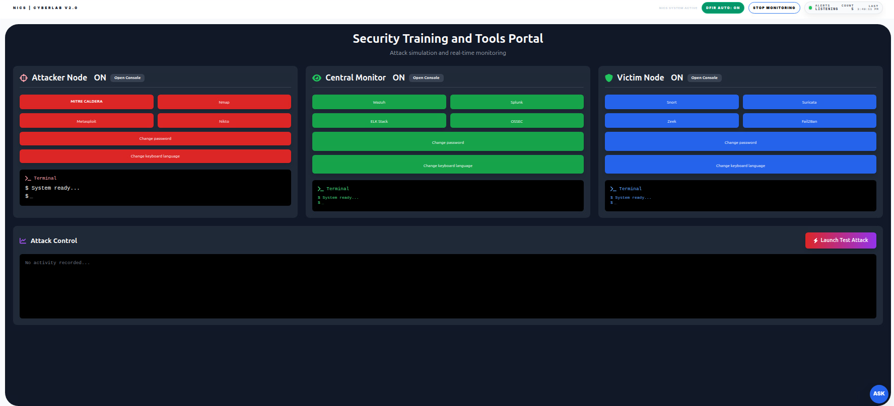

### Why it matters

This is the point where the platform becomes a true hands-on training environment. The user moves from deployment and installation into direct operational use of professional cybersecurity tooling.

---

## Tactical Cyber Operations Dashboard

The **Tactical Cyber Operations Dashboard** unifies attack execution, monitoring, contextual awareness, and feedback inside a single operational interface.

Its main capabilities include:

- an interactive battlefield map
- target locking through node selection
- attack launch from the attacker side
- contextual node intelligence
- dual-terminal feedback
- live monitoring output
- quick access to offensive and defensive tooling

The dashboard is inspired by a **fighter aircraft head-up display** model and is intended for integrated attack-and-detection exercises.

The user can:

- select a target node directly on the map
- inspect the node context before acting
- launch predefined attacks
- observe victim-side telemetry
- observe monitoring-side telemetry
- compare offensive behavior with defensive visibility in real time

Typical offensive actions include:

- tactical ping
- multi-attack execution
- unauthorized SSH
- port scan reconnaissance
- data exfiltration
- Modbus manipulation

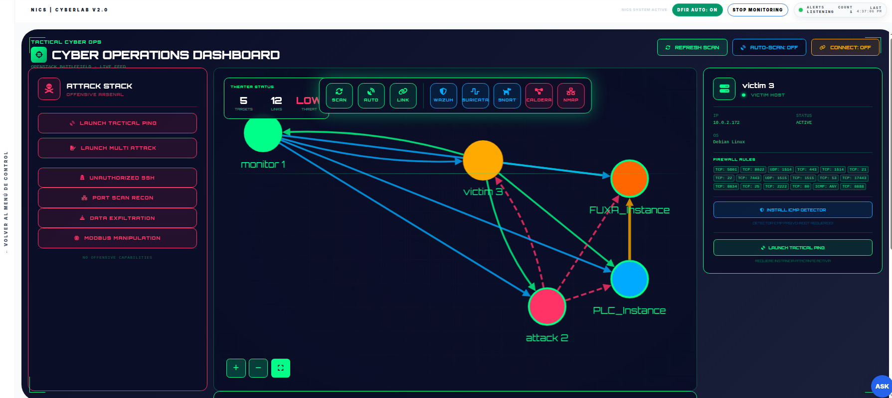
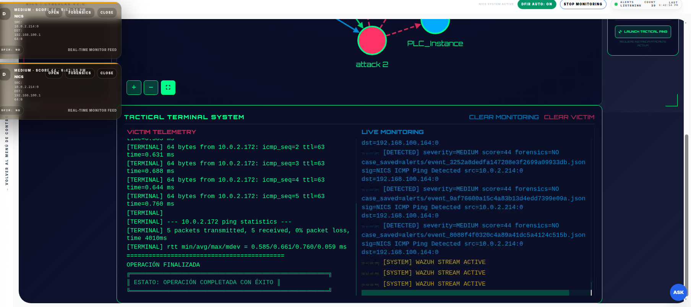

### Why it matters

This service makes the relationship between attack generation and detection explicit. After attacks are executed, the resulting events and alerts are registered and can be reviewed through the operational monitoring dashboard, which shows the active IT and OT components together with the generated indicators. This is especially useful for training, demonstrations, and controlled exercises in which the user must understand both sides of the event.

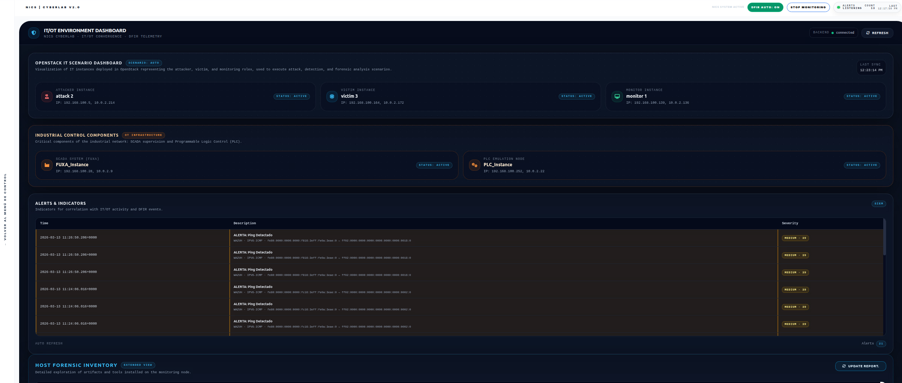

---

## Forensic Acquisition and Analysis Dashboard

The **Forensic Acquisition and Analysis Dashboard** is the forensic response surface of the platform. It exposes the manual workflow for case management, evidence acquisition, traffic preservation, and post-acquisition analysis.

Its main capabilities include:

- selection of the target instance
- creation and selection of forensic cases
- manual live traffic capture with automatic preservation inside the active case
- disk acquisition
- memory acquisition with LiME
- disk analysis with TSK
- memory analysis with Volatility 3
- manifest browsing and artifact download
- console-based operational traceability

The dashboard is tightly connected to the monitoring and DFIR workflow of the platform.

When monitoring and automated DFIR are enabled:

- **low-severity events** may only be recorded as alerts
- **higher-severity events** may trigger automatic forensic escalation, including case creation and evidence preservation

The manual dashboard reflects that same logic in an inspectable form and also gives the operator direct control when manual intervention is needed.

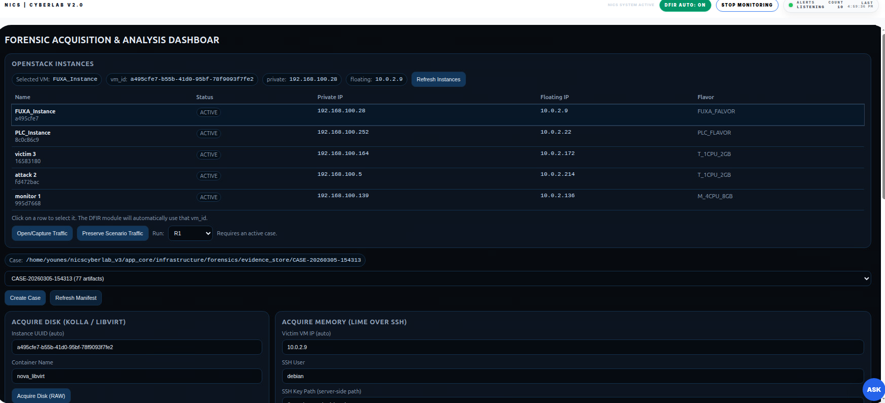
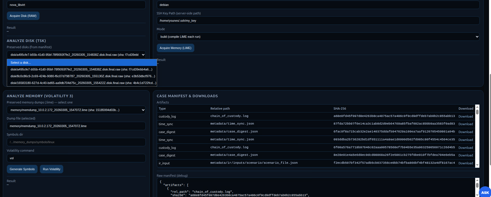

### Traffic capture

NICS CyberLab supports complementary traffic capture mechanisms at scenario level.

The platform performs periodic rolling traffic capture automatically. Traffic is collected every 120 seconds from the relevant host-side interfaces and stored as time-bounded PCAP segments. This allows continuous observation of network activity across the scenario even when no incident has been detected. In future versions, the capture frequency may be adjusted dynamically according to the operational state of the scenario and the level of risk measured within it.

The platform also provides user-triggered traffic capture from the interface. In this mode, the user selects the instance of interest and can observe and capture its traffic on demand for as long as needed.

Together, these mechanisms support both continuous background traffic collection and flexible operator-driven inspection.

### Traffic preservation inside the forensic case

When an incident requires forensic analysis, network traffic can be preserved as part of the active case. This preservation is not limited to the traffic captured at the time of detection. It may also include traffic collected periodically before and after the incident, so the case retains a broader network context.

This makes it possible to reconstruct network activity before, during, and after the incident. As a result, network evidence becomes part of the same structured case context as disk and memory artifacts, improving traceability, contextual reconstruction, and forensic analysis.

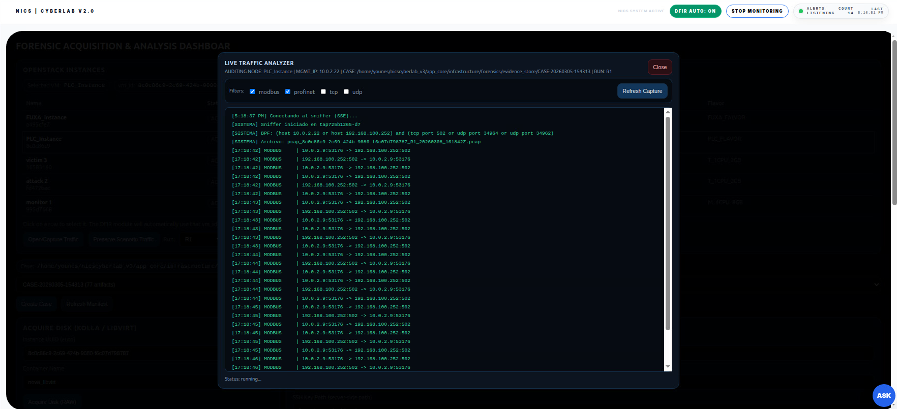

### Why it matters

This design separates operational traffic acquisition from forensic preservation while allowing both to work together. It supports continuous observability, user-driven inspection, and stronger case reconstruction through the integration of traffic, disk, and memory artifacts within a unified investigative context.

---

## Digital Forensics Report and Analysis Dashboard

The **Digital Forensics Report and Analysis Dashboard** is the case-centered forensic reporting surface of the platform. While the forensic acquisition dashboard focuses on collecting and preserving evidence, this service focuses on **understanding what has been preserved**, **where it is stored**, **how it can be downloaded**, and **what analytical and integrity context is attached to the case**.

Its main capabilities include:

- selection of an existing forensic case
- visualization of the preserved evidence inventory
- structured browsing of artifacts recorded in the case manifest
- direct download of preserved artifacts
- visibility of artifact paths and storage locations inside the case
- inspection of integrity-related metadata such as SHA-256 values
- review of chain of custody entries
- review of pipeline events associated with alerting, acquisition, preservation, and derived outputs
- summary of case-level artifact distribution and preservation status

The dashboard is designed to expose the **forensic structure of the case** in an operationally readable form. Instead of working only with raw directories and JSON files, the analyst can inspect the case through a unified interface that shows both the preserved artifacts and the metadata that explains their provenance.

This service is especially useful after acquisition has finished. At that point, the operator no longer needs only acquisition controls, but also a clear view of:

- which artifacts are available
- which system or node they belong to
- which artifacts are primary and which are derived
- whether integrity information is available
- how the preservation pipeline evolved over time

The dashboard is tightly connected to the internal case structure of the platform, including:

```bash
manifest.json
chain_of_custody.log
metadata/pipeline_events.jsonl
```

It also reflects the preserved evidence directories, including case content such as disk, memory, network, industrial, metadata, analysis, and derived artifacts.

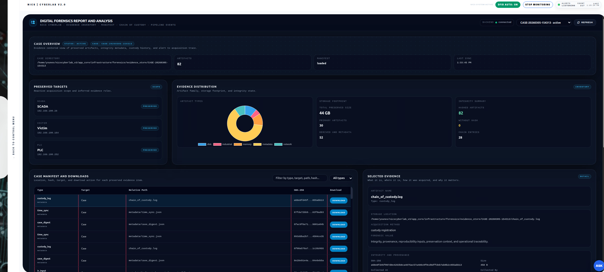
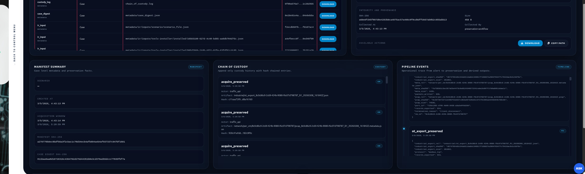

### Why it matters

This service turns the forensic case into an inspectable analytical object. It helps the user move from raw evidence preservation to structured forensic interpretation by exposing artifact inventory, provenance, integrity context, and operational chronology in a single view.

---


## 4. Remote Lab Exchange

**Remote Lab Exchange** is a platform capability that allows NICS CyberLab to exchange data with external machines or remote laboratory environments for later processing and structured feedback recovery.

This capability is designed to support workflows in which selected artifacts must be transferred outside the local scenario for specialized analysis and then returned to the platform in the form of reports, extracted results, or other derived outputs. The exchanged data may include network traffic captures, suspicious files, malware samples, structured datasets, logs, or other artifacts generated during experimentation.

Instead of treating this exchange as an isolated external workflow, NICS CyberLab incorporates it as an operational bridge between the local platform and remote processing environments. In this way, artifacts produced inside the platform can be exported to other analysis machines or partner labs, processed remotely, and then reintroduced into NICS CyberLab together with the corresponding feedback.

Typical actions supported through this capability include:

- selecting and preparing artifacts for exchange
- packaging files when needed
- transferring artifacts to remote machines or labs
- launching remote processing tasks
- verifying remote execution status
- receiving processed outputs or analysis reports
- visualizing returned feedback inside the platform

This makes it possible to use NICS CyberLab not only as a local experimentation environment, but also as a coordination point for distributed analysis workflows involving external machines or remote labs.

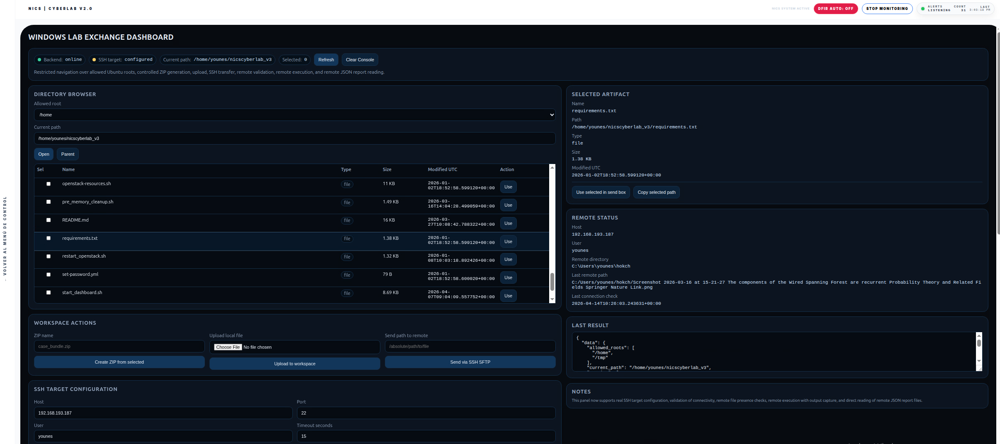

### Why it matters

This capability extends NICS CyberLab beyond local execution boundaries. It allows the platform to send traffic captures, suspicious files, malware-related artifacts, logs, datasets, or other experiment outputs to external systems for remote processing, and then recover the resulting feedback in an inspectable way. As a result, NICS CyberLab can participate in distributed experimentation and analysis workflows without breaking the continuity of the platform experience.

---

## 5. End-to-end usage sequence

A typical end-to-end workflow is:

### Step 1

Deploy the OpenStack infrastructure with:

```bash
bash openstack-installer/openstack-installer.sh
```

### Step 2

Launch the dashboards with:

```bash
bash start_dashboard.sh
```

### Step 3

Create the base IT scenario in the **IT Scenario Editor**.

### Step 4

If needed, extend it with **PLC** and **SCADA** components in the **Industrial Scenario Editor**.

### Step 5

Install the required offensive, defensive, monitoring, and analysis tools with the **Instance Tools Manager**.

### Step 6

Access the installed tools through the **Security Training and Tools Portal** and interact with their real dashboards or consoles.

### Step 7

Run integrated exercises in the **Tactical Cyber Operations Dashboard** to observe both the attack side and the monitoring side.

### Step 8

When the incident severity justifies it, preserve and analyze evidence through the **Forensic Acquisition and Analysis Dashboard**.

### Step 9

Review the preserved case, artifact inventory, manifest, chain of custody, and pipeline events in the **Digital Forensics Report and Analysis Dashboard**.

---

## 6. Key platform strengths

NICS CyberLab brings together capabilities that are often separated across multiple environments:

- **Automated infrastructure deployment**
- **Visual scenario modeling**
- **Hybrid IT and IT/OT support**
- **Centralized node-level tool installation**
- **Direct access to real cybersecurity tools**
- **Integrated attack-and-detection exercises**
- **Case-aware forensic acquisition and analysis**
- **Case-centered forensic reporting and evidence review**
- **Educational and professional usability**
- **Operational traceability across the workflow**

This combination makes the platform suitable for:

- cybersecurity training
- guided laboratory exercises
- attack-and-detection demonstrations
- DFIR workflow validation
- hybrid IT/OT experimentation
- reproducible security research environments

---

## 7. Important paths

### Infrastructure deployment

```bash
openstack-installer/openstack-installer.sh
```

### OpenStack virtual environment

```bash
openstack-installer/openstack_venv
```

### Generated OpenStack credentials

```bash
admin-openrc.sh
```

### Dashboard launcher

```bash
start_dashboard.sh
```

### OpenStack service recovery

```bash
restart_openstack.sh
```

### Example PLC program

```bash
industrial-scenario/PLC/plc_programs/TankControl.st
```

---

## 📝 Acknowledgments

This repository has been partially supported by the project "CiberIA: Investigación e Innovación para la Integración de Ciberseguridad e Inteligencia Artificial" (Proyecto C079/23), financed by "European Union NextGeneration-EU, the Recovery Plan, Transformation and Resilience", through INCIBE. It has also been partially supported by the project SecAI (PID2022-139268OB-I00) funded by the Spanish Ministerio de Ciencia e Innovacion, and Agencia Estatal de Investigacion.
