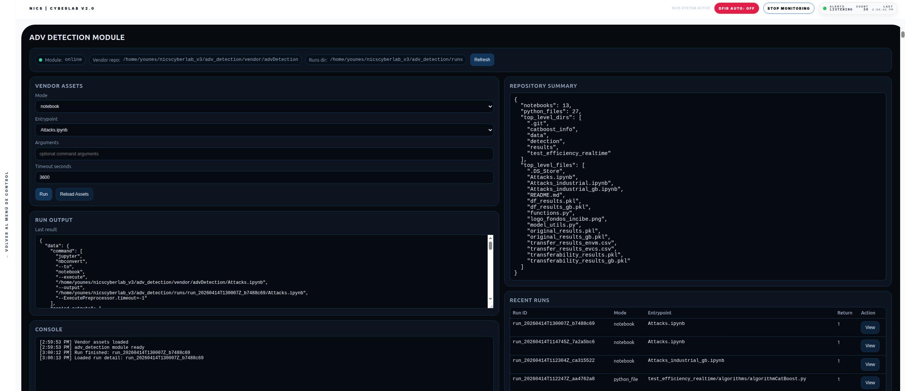

# adv_detection

`adv_detection` is an integrated NICS CyberLab module that provides a simple interface to execute and review experiments from the external repository `advDetection`.

The goal of the module is to let the user browse the available experiments from the original repository, execute them from the interface, and inspect the result of each execution in an organized way. The module does not replace the original project and does not create its own anomaly detector. Instead, it acts as a bridge that allows the experiments already included in the repository to be launched and reviewed inside NICS CyberLab.

From the user point of view, the page is divided into several functional areas.

The top status section shows whether the module is online, where the external repository is located, and where the executions are being stored. This section is only informative and helps confirm that the integration is available and correctly connected.

The `Refresh` button updates the page state. Functionally, it reloads the module status, refreshes the detected repository information, reloads the list of available experiment files, and updates the list of previous runs. It does not execute any experiment from the repository.

The `Mode` selector defines how the `Run` button will behave. In notebook mode, the module will execute a notebook from the external repository. In Python file mode, it will execute a Python script from the repository. In custom command mode, it will execute the exact command written by the user. This selector therefore determines the type of execution that the module will perform.

The `Entrypoint` selector shows the available files that can be launched from the external repository. If notebook mode is selected, the list contains notebooks. If Python file mode is selected, the list contains Python scripts. The selected file is the one that will actually be executed when the user presses `Run`.

The `Arguments` field allows the user to pass optional extra parameters to the selected notebook or script. These arguments are attached to the execution command. If no arguments are needed, the field can be left empty.

The `Timeout seconds` field defines the maximum execution time allowed for the selected experiment. If the execution exceeds this time, it may be interrupted by the backend. This field is useful to prevent very long or blocked runs.

The `Run` button is the main action button of the module. Functionally, it takes the current execution mode, the selected entrypoint, the optional arguments, and the timeout value, and sends them to the backend. The backend then prepares the environment if necessary, launches the chosen experiment from the external repository, creates a new run entry, stores the execution logs, and returns a technical summary of the result. In practice, this is the button that actually runs a notebook, a Python file, or a user command from the `advDetection` repository.

The `Reload Assets` button rescans the external repository and refreshes the available notebooks and scripts shown in the interface. Functionally, it only updates the visible list of executable files. It does not launch anything.

The `Run Output` area shows the structured result of the most recent execution. This usually includes whether the execution succeeded or failed, the run identifier, the command that was launched, the start and finish time, and the paths where the output and error logs were stored. This section is useful to understand the immediate result of pressing `Run`.

The `Console` area is a frontend activity log. It records user-facing events such as assets being reloaded, runs being launched, or run details being opened. It is not the scientific output of the experiment itself. It is only a page-level activity trace.

The `Repository Summary` section provides a quick summary of the connected external repository. Functionally, it shows how many notebooks and Python files were detected and what main folders or top-level files exist in the project. This helps the user understand what kind of material is available to execute.

The `Recent Runs` table shows the history of previous executions. Each row corresponds to one run that has already been performed. It includes the run identifier, the execution mode, the entrypoint used, and the return code. This lets the user quickly see which experiments were attempted and whether they finished successfully or failed.

The `View` button in the `Recent Runs` table does not execute anything new. Functionally, it loads the stored detail of a selected past run and displays its metadata and logs in the lower section of the page.

The `Run Detail` section shows the information of a selected previous run. It includes the run identifier, the start and finish time, the return code, the list of generated or copied files, and the content of the standard output and standard error logs. This section is the main place for reviewing what happened during a past execution.

The `STDOUT` field displays the normal output produced during the execution. This may contain printed messages, progress information, or other regular outputs generated by the notebook or script.

The `STDERR` field displays the error output produced during the execution. If a run fails, the real reason is usually found here. This is the most important place for diagnosing missing dependencies, invalid imports, broken paths, or other runtime problems.

In practical terms, only one button on the page actually executes something from the external repository: `Run`. The buttons `Refresh`, `Reload Assets`, and `View` only reload or display information. They do not launch notebooks or scripts.

In summary, this module is a simple execution and review interface for the external `advDetection` project. It allows the user to choose an experiment, launch it from NICS CyberLab, store the execution as an independent run, and inspect its results and possible errors from the interface without mixing the external repository into the core platform.
