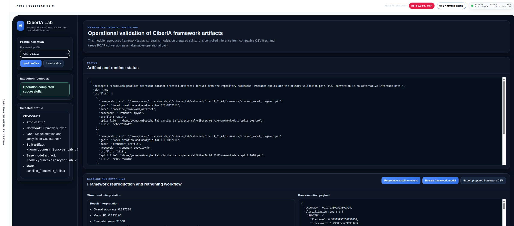

# ciberia_lab

`ciberia_lab` is an integrated NICS CyberLab module for network flow classification, model retraining, controlled inference, and artifact-oriented validation based on the original CiberIA framework.

Original repository: https://github.com/nicslabdev/CiberIA_O1_A1

This module brings the original CiberIA work into NICS CyberLab through a dedicated graphical interface. Its purpose is to let the user reproduce framework artifacts, retrain models on supported profiles, run inference on prepared CSV files, and use PCAP conversion as an alternative operational path when structured CSV inputs are not already available.

From the user perspective, the module is designed around a clear visual workflow.

The left panel is focused on profile selection and quick module status. The user chooses the framework profile to work with, such as `CIC-IDS2017`, `CIC-IDS2018`, or `UNSW-NB15`. This choice determines the reference dataset profile used by the module for artifact inspection, retraining, inference compatibility, and result interpretation.

The `Load profiles` button loads the available framework profiles and shows the information associated with the selected one. Functionally, it helps the user inspect what profile is currently active and what artifact context is going to be used in the following actions.

The `Load status` button refreshes the operational state of the module. Its role is to show whether the framework artifacts, runtime dependencies, and internal execution state are available and ready. It is a verification action and does not launch training or inference.

The `Selected profile` area visually summarizes the currently chosen framework profile. This part of the interface helps the user confirm that the module is pointing to the expected dataset family and working context before launching any execution.

The main content area is divided into functional sections.

The `Artifact and runtime status` section provides a direct view of the current backend and artifact state. Its purpose is to expose the current operational context of the module in a visible and structured way.

The `Framework reproduction and retraining workflow` section is the main area for baseline evaluation and retraining. It includes three important actions.

The `Reproduce baseline results` button launches the baseline framework validation process. Functionally, it is used to reproduce the reference behavior of the original framework artifacts for the selected profile.

The `Retrain framework model` button launches model retraining for the selected framework profile. This is the main action used when the user wants to rebuild or re-evaluate the model behavior instead of only reproducing existing baseline artifacts.

The `Export prepared framework CSV` button generates or exports a prepared CSV file aligned with the framework expectations. Its purpose is to provide a compatible structured input that can later be reused in the inference workflow.

Inside this same section, the interface also provides a structured explanation box, a raw execution payload view, and a per-class evaluation table. These visual areas are important because they do not only show whether an execution finished, but also present interpretable feedback and class-level results in a way that is easier to inspect than raw backend output alone.

The `Inference on framework-compatible feature tables` section is the primary inference path of the module. This is the preferred route when the user already has a prepared CSV file that matches the framework schema.

The `Run CSV inference` button applies the selected framework model or execution workflow to the uploaded CSV file. Functionally, this is the main prediction action when the input data is already available in structured tabular form.

This section also includes graphical areas for inference interpretation, execution summary, raw payload inspection, and prediction rows. These interface elements are important because they allow the user to review both the technical backend response and the actual prediction content produced by the module.

The `PCAP to compatible CSV generation` section is the alternative preparation path. It is intended for situations where the user does not yet have a compatible CSV file.

The `Convert PCAP to compatible CSV` button takes a traffic capture file and transforms it into a CSV representation that is more suitable for the framework workflow. Functionally, this is not yet the final inference step. It is a preparation step that helps move from raw traffic capture to a structured format that can later be consumed by the classification pipeline.

This section also includes a raw execution payload area and a conversion summary area so that the user can understand what was generated and how the conversion process behaved.

The `Inference from generated traffic features` section is the alternative PCAP-oriented inference route.

The `Run alternative PCAP inference` button applies the inference workflow starting from an uploaded PCAP file. In practical terms, this section represents the case where the user wants the module to go from traffic-oriented input toward prediction-oriented output without manually preparing the CSV first.

This section includes interpretation panels, summary panels, raw execution payload, and prediction rows. These interface elements are especially useful because they make the output visually inspectable and allow the user to understand the result without relying only on backend logs.

From a usage perspective, the graphical interface emphasizes four main operational modes.

First, profile-oriented framework inspection through profile loading and status validation.

Second, baseline reproduction and retraining through the central workflow controls.

Third, primary inference through prepared CSV files, which is the main structured validation path.

Fourth, alternative PCAP-based processing and inference, which provides a secondary route when structured CSV inputs are not directly available.

In summary, `ciberia_lab` is the NICS CyberLab graphical module for operationalizing the original CiberIA framework. It combines profile selection, framework validation, model retraining, CSV-based inference, PCAP conversion, and alternative PCAP inference in a single integrated interface designed to make the workflow visible, guided, and easier to interpret.