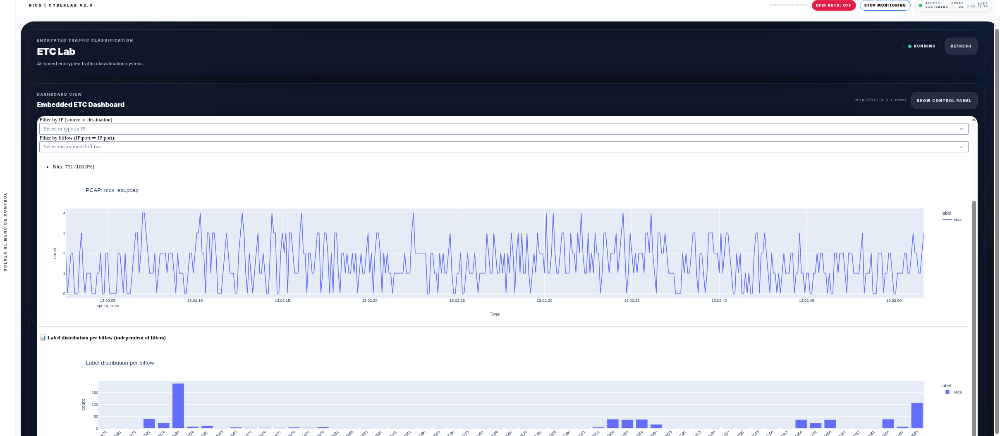

# ETC Lab

`ETC Lab` is an integrated NICS CyberLab module for packet-level encrypted traffic classification based on the original repository `packet-level-etc`.

Original repository: https://github.com/nicslabdev/packet-level-etc

The purpose of this module is to bring the original packet-level encrypted traffic classification workflow into NICS CyberLab through a dedicated graphical interface. The external repository includes the main components required for this workflow, such as feature extraction, machine learning training, deep learning training, prediction, and a Dash-based dashboard. In the repository, the main visible files include `dash_app.py`, `extract_features.py`, `ml_train_models.py`, `dl_train_models.py`, `models.py`, and `predict.py`. :contentReference[oaicite:1]{index=1}

Inside NICS CyberLab, this module is presented as a control and visualization panel. Its role is to help the user install the ETC environment, prepare the runtime, launch the dashboard, and interact with the traffic classification workflow from a clear visual interface.

## General purpose

This module is designed to support encrypted traffic classification experiments. It combines three main ideas:

- controlled installation of the original ETC environment
- runtime control of the ETC dashboard
- visual access to the classification workflow through an embedded dashboard

In practical terms, the module does not replace the original repository. Instead, it acts as an integrated graphical layer that allows the repository to be deployed and used from within NICS CyberLab.

## Role of the original repository

The original `packet-level-etc` repository is the technical core behind this module. It contains the files required for the ETC workflow, including:

- `extract_features.py` for feature extraction
- `ml_train_models.py` for machine learning model training
- `dl_train_models.py` for deep learning model training
- `predict.py` for inference
- `dash_app.py` for the dashboard interface
- `features/` and `models/` directories for generated artifacts and trained models :contentReference[oaicite:2]{index=2}

This means that the module is not an independent classifier by itself. The actual ETC logic comes from the original repository, while NICS CyberLab provides the interface for deployment, control, and visualization.

## Functional description of the interface

The interface is organized into two main visual states:

- an installation and control view
- an embedded dashboard view

This makes the workflow easier to follow because the user can first prepare the environment and later move into the dashboard-oriented usage mode.

## Top status area

The upper status area provides a quick view of the current module situation.

It includes:

- the module status indicator
- a status text such as checking, installing, running, ready, or not installed
- a refresh action

### Refresh
The `Refresh` button updates the current state of the module. Functionally, it reloads the backend status, checks whether the ETC repository is installed, verifies whether the models are ready, checks whether the dashboard is running, and refreshes the visible information shown in the control panel. It does not perform installation, training, or inference by itself.

## Installation and control panel

This is the main operational area when the ETC module is not yet fully prepared or when the user wants to manage its execution state.

### Capture Interface
This field allows the user to define the network interface that the ETC workflow should use for traffic capture or traffic-related processing.

### Capture Seconds
This field defines the capture duration in seconds. It provides control over how long the traffic capture phase should run when the ETC workflow requires packet acquisition.

### Base Directory
This field defines the base working directory used by the module runtime. It determines where the ETC environment is prepared and where the repository runtime will be handled.

## Main control buttons

### Install
The `Install` button launches the installation workflow of the ETC module.

Functionally, this button is used to prepare the ETC environment from the original repository. The module sends the selected installation parameters to the backend and starts the installation process. During this process, the interface opens a live installation log stream and keeps updating the state panel.

This is the main button used to deploy the packet-level ETC environment inside NICS CyberLab.

### Start
The `Start` button launches the ETC dashboard runtime.

Functionally, this means that the backend starts the service associated with the ETC dashboard, which is expected to be based on the `dash_app.py` component from the original repository. Once the dashboard is running, the user can move into the embedded dashboard view. The repository includes `dash_app.py` as one of its main entry files. :contentReference[oaicite:3]{index=3}

### Stop
The `Stop` button stops the ETC dashboard runtime.

Functionally, it terminates the running ETC dashboard service and clears the embedded dashboard frame. This is the action used to shut down the module runtime when the dashboard is no longer needed.

### Open Dash
The `Open Dash` button opens the dashboard view of the ETC module.

Before opening the dashboard, the module checks whether the ETC environment is installed and whether the model is ready. If the environment is not installed, or if the model is not ready, the interface keeps the user in the control panel and shows an explanatory warning. If the environment is ready, the dashboard is opened in the embedded frame.

This is the main access point to the visual analytics part of the ETC workflow.

## State panel

The state panel shows the runtime state of the ETC module.

It summarizes information such as:

- whether the ETC environment is installed
- whether the model is ready
- whether installation is currently in progress
- whether the dashboard is currently running
- the repository location
- the PCAP directory
- the time of the last installation
- the time of the last dashboard start
- a short backend message

This panel is important because it gives the user a quick operational overview of the module before launching further actions.

## Install Log

The install log is a live textual view of the installation process.

Its purpose is to provide visibility into what the backend is doing while the ETC module is being prepared. This helps the user confirm that installation started correctly and inspect possible failures if something goes wrong.

## Embedded ETC Dashboard

The embedded dashboard section is the visual runtime view of the ETC module.

It loads the ETC dashboard inside an iframe and provides direct visual access to the interface served by the original ETC workflow. Since the repository includes `dash_app.py`, this embedded section is the natural visual bridge between NICS CyberLab and the original packet-level ETC dashboard. :contentReference[oaicite:4]{index=4}

### Show Control Panel
When the dashboard view is open, the `Show Control Panel` button returns the user to the installation and runtime management panel.

This makes the interface easy to navigate because the user can alternate between operational control and dashboard visualization without leaving the module.

## Functional workflow

From a practical perspective, the ETC Lab module supports the following workflow:

1. The user opens the module inside NICS CyberLab.
2. The control panel checks whether the ETC environment is already installed and whether the dashboard is available.
3. If the environment is not ready, the user defines the desired parameters and presses `Install`.
4. The installation log streams the backend output while the ETC runtime is being prepared.
5. Once installed, the user can press `Start` to launch the dashboard service.
6. If the model and runtime are ready, the user can press `Open Dash`.
7. The ETC dashboard is displayed inside the embedded view.
8. The user can return to the control panel at any time with `Show Control Panel`.
9. When needed, the user can stop the running service with `Stop`.

## What this module contributes to NICS CyberLab

This module contributes an integrated environment for encrypted traffic classification based on packet-level processing. It gives NICS CyberLab a graphical and operational interface to manage the lifecycle of the original ETC repository, from installation to runtime visualization.

Its main value is not only classification itself, but also usability. It turns the original research-oriented repository into a controlled, inspectable, and embedded module that can be operated from within the broader NICS CyberLab platform.

## Summary

`ETC Lab` is the NICS CyberLab module for integrating the original `packet-level-etc` repository into a guided visual workflow. It allows the user to install the ETC environment, manage its runtime state, and access the original dashboard through an embedded interface. In this way, NICS CyberLab provides the operational layer, while the original repository provides the packet-level encrypted traffic classification functionality. 